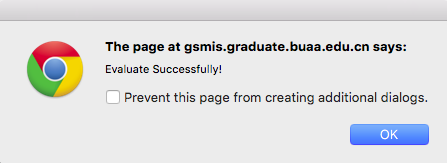

#北航研究生自动评教脚本

一次点击完成所有老师评教

支持北航研究生教务管理系统

**仅支持Chrome浏览器**

##Install 安装

1. 使用 `Command` + `Shift` + `B` 快捷键，显示Chrome浏览器中书签栏
	
	

2. 将下面的紫色按钮拖拽至书签栏，完成安装
	
	<a class="button button-royal button-rounded" href="">自动评教</a> 
	<em style="font-size:13px;color:gray">将此按钮拖拽至书签栏，点击无效</em>
	
	

##Use 使用

1. 进入研究生教务管理系统，选择 `学生课程管理`、`学生填写评教信息`

2. 点击浏览器书签栏中的 `自动评教` 按钮，等待脚本执行

3. 执行完成后弹出成功窗口，确定后页面刷新，可查看评教结果
	
	

**由于网络状态原因，可能有部分老师未评价成功，此时重新运行一次脚本即可。**

> Siyu Yang yangsiyu1992[at]gmail.com

<link rel="stylesheet" type="text/css" href="static_files/buttons.css">